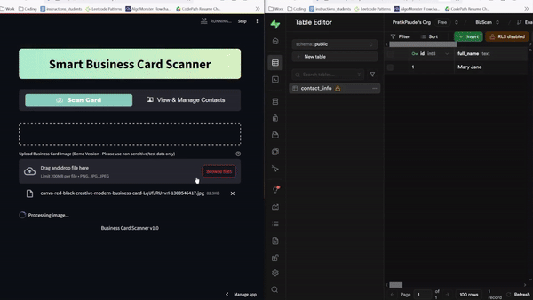

# BizScan - Smart Business Card Scanner 📇

BizScan is an intelligent business card management system that transforms physical business cards into organized digital contacts. Using advanced OCR technology, it streamlines the process of networking and contact management for professionals, making it easy to digitize, store, and manage your business connections.

 <!-- Add your demo gif here -->

## Features ✨

- **Instant Card Scanning**: Upload and digitize business cards with advanced OCR
- **Smart Information Extraction**: Automatically extracts contact details including names, emails, phones, and addresses
- **Contact Management**: Easy-to-use interface for managing digital contacts
- **Powerful Search**: Quickly find contacts across all fields
- **Data Visualization**: Real-time visualization of detected text regions on scanned cards
- **Edit & Update**: Modify contact information with an intuitive form interface
- **Modern UI**: Clean, responsive design with professional aesthetics

## Technology Stack 🛠️

- **Frontend**: Streamlit
- **Backend**: Python
- **OCR Engine**: EasyOCR
- **Image Processing**: OpenCV
- **Database**: Supabase
- **Data Handling**: Pandas
- **Visualization**: Matplotlib
- **Styling**: Custom CSS

## Installation 🚀

1. Clone the repository:
```bash
git clone https://github.com/pratikpaudel/bizscan.git
cd bizscan
```

2. Create and activate virtual environment:
```bash
python -m venv venv
source venv/bin/activate  # On Windows: venv\Scripts\activate
```

3. Install dependencies:
```bash
pip install -r requirements.txt
```

4. Set up Supabase and create a `.env` file:
```env
SUPABASE_URL=your_project_url
SUPABASE_KEY=your_api_key
```

5. Run the application:
```bash
streamlit run ocr.py
```

## Supabase Setup 💾

1. Create a new project in Supabase
2. Create the contacts table using SQL editor:
```sql
create table public.contact_info (
    id bigint primary key generated always as identity,
    full_name text,
    organization text,
    job_title text,
    contact_number varchar(50),
    business_email text,
    business_url text,
    street_address text,
    location_city text,
    location_state text,
    postal_code varchar(10),
    created_at timestamp with time zone default timezone('utc'::text, now()),
    last_modified timestamp with time zone default timezone('utc'::text, now())
);
```

## Usage 📱

1. **Upload Business Card**:
   - Navigate to 'Scan Card' tab
   - Upload a business card image (PNG, JPG, JPEG)
   - View real-time text detection visualization

2. **Review & Edit**:
   - Verify automatically extracted information
   - Edit any fields as needed
   - View raw OCR text if needed
   - Save contact to database

3. **Manage Contacts**:
   - Switch to 'View & Manage Contacts' tab
   - Use the search function to find specific contacts
   - Edit or delete existing contacts
   - View all contacts in an organized table

## Features in Development 🚧

- Mobile responsiveness optimization
- Batch card processing
- Export functionality to common formats
- Integration with popular CRM systems
- Advanced search filters
- Contact categorization and tagging

## Contributing 🤝

1. Fork the project
2. Create your feature branch (`git checkout -b feature/AmazingFeature`)
3. Commit your changes (`git commit -m 'Add some AmazingFeature'`)
4. Push to the branch (`git push origin feature/AmazingFeature`)
5. Open a Pull Request

## License 📄

This project is licensed under the MIT License - see the [LICENSE](LICENSE) file for details.

## Acknowledgments 🙏

- EasyOCR for the powerful OCR engine
- Streamlit for the intuitive web framework
- OpenCV for image processing capabilities
- Supabase for the robust backend infrastructure

## Contact 📧

Pratik Paudel - [prateekpaudel2017@gmail.com](mailto:prateekpaudel2017@gmail.com)

Project Link: [https://github.com/pratikpaudel/bizscan](https://github.com/pratikpaudel/bizscan)
